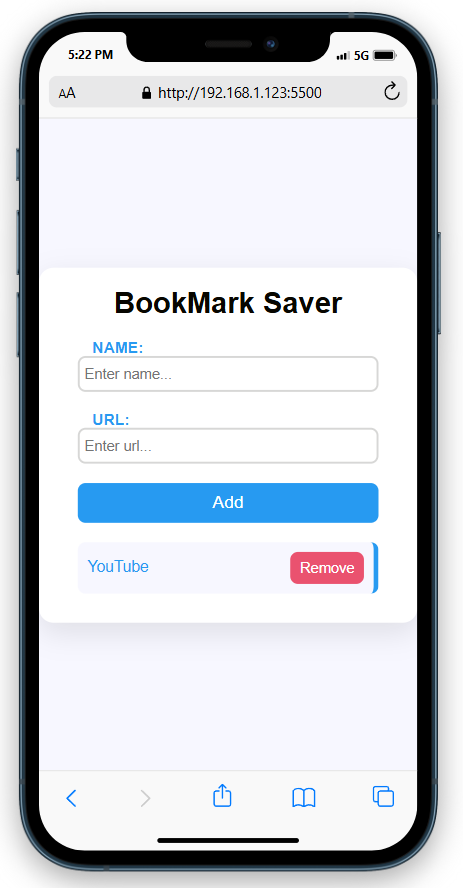

# 🗂️ Bookmark Saver App

A simple web application to save, view, and manage bookmarks using the browser's local storage. Built with vanilla JavaScript, HTML, and CSS. No frameworks, no databases, just clean client-side functionality. 

A JavaScript project demonstrating how to store and retrieve data using the browser's `localStorage` API. It shows how to save and load both strings and objects, as well as how to remove or clear saved data.

## 🌟 Features

- ✅ Add website bookmarks with name and URL.
- ✅ Save data in `localStorage`.
- ✅ View saved bookmarks as clickable links.
- ✅ Delete individual bookmarks.
- ✅ Responsive and lightweight design.

## 📸 Screenshot

## 🛠️ Technologies

- HTML5
- CSS
- JavaScript (Vanilla)
- Browser Local Storage

## 🔧 How to Use

1. Clone the repository or download the ZIP.
2. Open `index.html` in any modern web browser.
3. Open Developer Tools > Console to view the output of data being saved, loaded, or removed from localStorage.

## 📌 Notes
- Data in `localStorage` does not expire unless manually removed.
- No setup, no dependencies. Just open `index.html` in your browser.